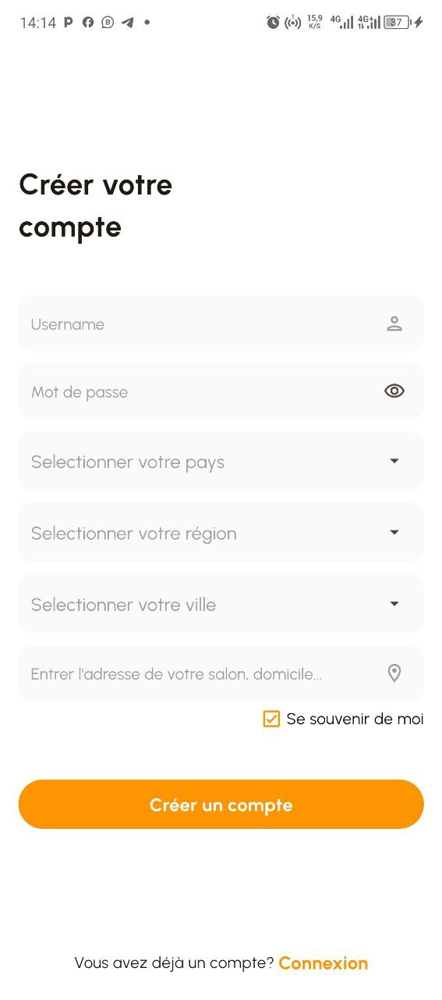
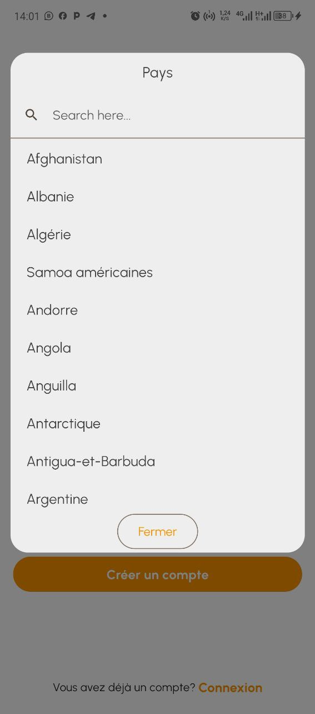
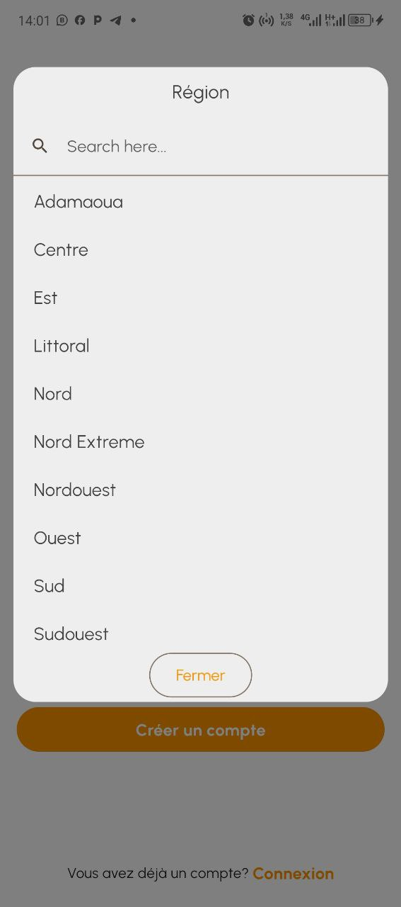
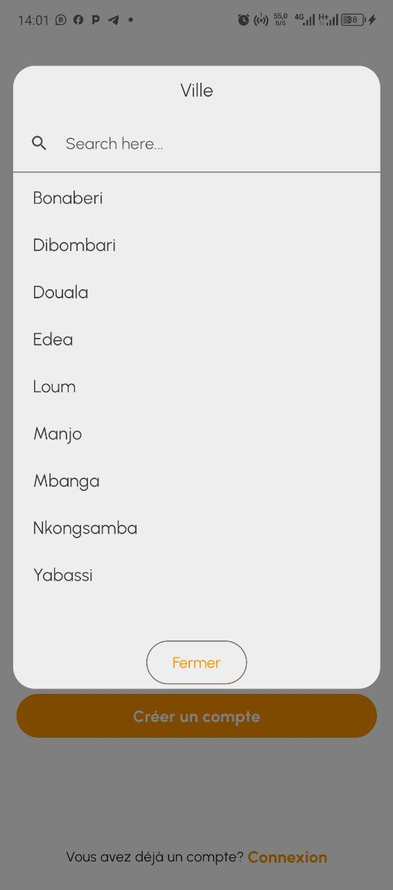
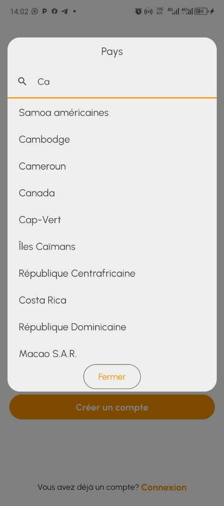
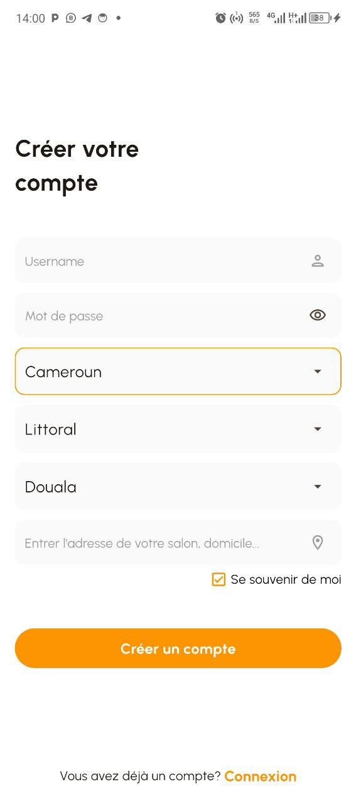

# custom_country_state_city

A new Flutter package to get world's all of Country, State, and City.
And items are also searchable, support country locale(fr & en). 
In addition if city can't be found then user manually write city on dialog window.

## Getting Started add

### Platforms:
This widget has been successfully tested on iOS, Android and Chrome.

## Screenshots
| Outlook                                   | Country Dialog                            |git
|-------------------------------------------|-------------------------------------------|
|  |  |

| Country Searching                         | State Dialog                              |
|-------------------------------------------|-------------------------------------------|
|  |  |

| City Dialog                               | Final Data                                |
|-------------------------------------------|-------------------------------------------|
|  |  |

## Usage
```dart
import 'package:custom_country_state_city/custom_country_state_city.dart';

///Define Controller
TextEditingController country=TextEditingController();
TextEditingController state=TextEditingController();
TextEditingController city=TextEditingController();

///Widget initialize
CustomCountryStateCityPicker(
                country: country,
                state: state,
                city: city,
                dialogColor: Colors.grey.shade200,
                textFieldDecoration: InputDecoration(
                  fillColor: Colors.blueGrey.shade100,
                  filled: true,
                  suffixIcon: const Icon(Icons.arrow_downward_rounded),
                  border: const OutlineInputBorder(borderSide: BorderSide.none))
            ),
```

## Example Code
```dart
import 'package:flutter/material.dart';
import 'package:country_state_city/custom_country_state_city_picker.dart';

void main() {
  runApp(MyApp());
}
class MyApp extends StatelessWidget {
  @override
  Widget build(BuildContext context) {
    return MaterialApp(
      title: 'Country->State->City',
      theme: ThemeData(
        primarySwatch: Colors.blue,
      ),
      home: HomePage(),
    );
  }
}

class HomePage extends StatefulWidget {
  @override
  _HomePageState createState() => _HomePageState();
}
class _HomePageState extends State<HomePage> {
  TextEditingController country=TextEditingController();
  TextEditingController state=TextEditingController();
  TextEditingController city=TextEditingController();
  @override
  Widget build(BuildContext context) {
    return Scaffold(
      appBar: AppBar(
        title: Text('Country->State->City'),
      ),
      body: Padding(
          padding: EdgeInsets.all(15.0),
          child: Column(
            children: [
              CustomCountryStateCityPicker(
                  country: country,
                  state: state,
                  city: city,
                  locale: "fr",
                  fieldHintText: const FieldHintText(
                      countryHintText: "Selectionner votre pays",
                      stateHintText: "Selectionner votre région",
                      cityHintText: "Selectionner votre ville"
                  ),
                  dialogTitle: const DialogTitle(
                      countryDialogTitle: "Pays",
                      stateDialogTitle: "Région",
                      cityDialogTitle: "Ville"
                  ),
                  closeTextButton: "Fermer",

                  dialogColor: Colors.grey.shade200,
                  textFieldDecoration: const InputDecoration(
                      fillColor: AppColor.backgroundColor2,
                      filled: true,
                      hintStyle: TextStyle(
                        color: Colors.grey,
                        fontSize: 15,
                      ),
                      focusedBorder: OutlineInputBorder(
                          borderRadius: BorderRadius.all(Radius.circular(10)),
                          borderSide: BorderSide(
                              color: AppColor.primaryColor
                          )
                      ),
                      enabledBorder: OutlineInputBorder(
                          borderRadius: BorderRadius.all(Radius.circular(10)),
                          borderSide: BorderSide(
                              color: AppColor.backgroundColor2
                          )
                      ),
                      isDense: true,                      // Added this
                      contentPadding: EdgeInsets.all(10),
                      suffixIcon: Icon(Icons.arrow_drop_down),
                      border: OutlineInputBorder(
                          borderSide: BorderSide.none,
                          borderRadius: BorderRadius.all(Radius.circular(5))
                      ))
              ),
              SizedBox(height: 20),

              Text("${country.text}, ${state.text}, ${city.text}")
            ],
          )
      ),
    );
  }
}
```

## Connect with
<a href="mailto:empereurfranck95@gmail.com">empereurfranck95@gmail.com</a><br>
<a href="https://github.com/TchatchoKemajou">Find more project on github</a>
